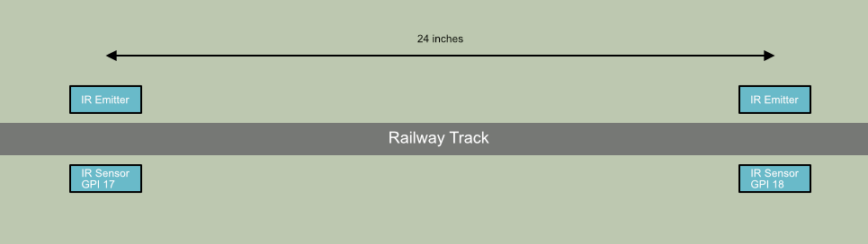

# TrainScaleSpeed
Use infrared light sensors and a RaspberryPi to calculate train speed on a model railway.

## Parts Used
- 2x [IR break beam sensors](https://thepihut.com/products/ir-break-beam-sensor-3mm-leds)
- 1x RaspberryPi (any type with GPIO)

## Operation
IR break beam sensors are placed 24 inches apart on either side of the track. With the Python script running any train passing along the track will break the IR beams which start and stop a timer. Using the measured time and known distance between sensors the scale speed in mph can be calculated.

The code assumes GPI 17 and 18 are used for the sensors and that they are 24 inches apart. Different distances and GPI pins can be used by simply modifying the code. 
